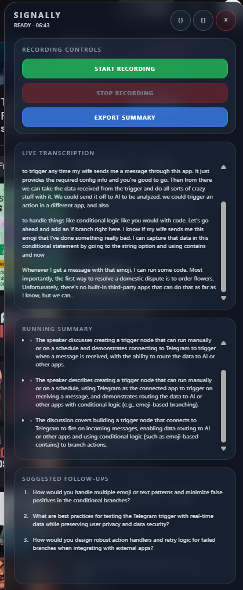

# Short description of work
Spent a lot of time trying to get whisper.cpp wasm working but failed so I have given up on it for now, will use the live transcription API now
For now I have removed dummy data, added audio capture for a tab recording audio, I followed this [example](https://github.com/GoogleChrome/chrome-extensions-samples/blob/main/functional-samples/sample.tabcapture-recorder/)
Also added a settings window so we can add openAI key (for whisper transcription model)

Here's the options window, aswell as showing the recording that got downloaded

